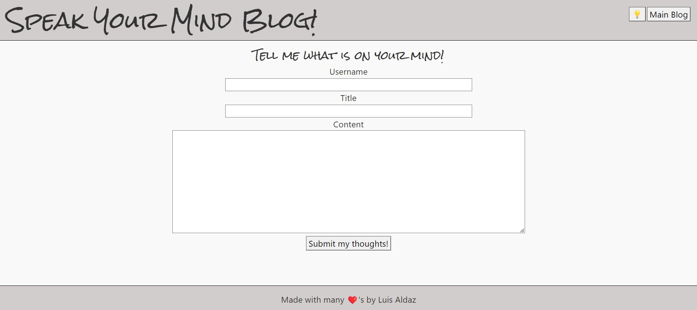
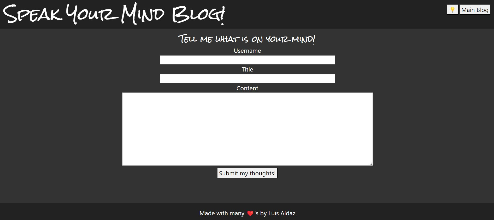
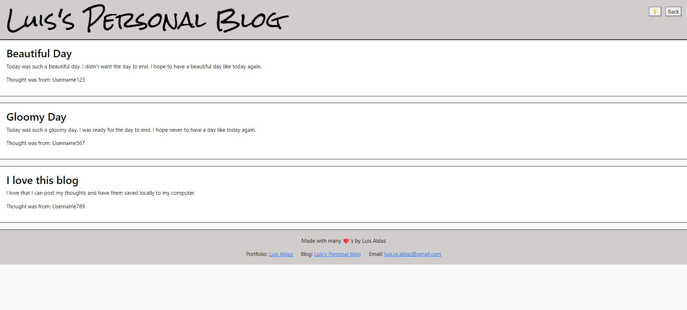
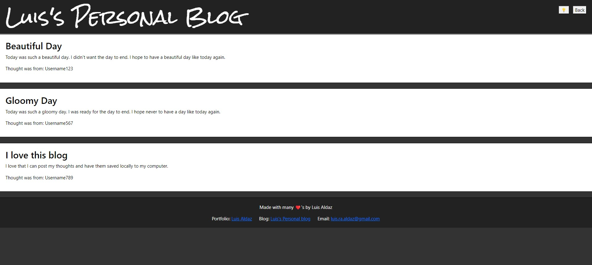

# Luis's Personal Blog (Module 04 Web APIs Challenge ) 

## This Challenge contains my my personal blog to include the following functions:
- Allows for wesbite visitor to enter a username, title, and thoughts.
- Once you hit the submit button, the website visitor is redirected to a second page in which it shows the post you just entered and any other posts they have entered in the past.
- The information entered is saved locally to the storage.

## Installation
- To access my personal blog website follow link: https://ricanlonghorn23.github.io/Luis-Personal-Blog/
- To Access my personal blog website repository: https://github.com/ricanlonghorn23/Luis-Personal-Blog.git

## Usage
The user will need to enter the URL https://ricanlonghorn23.github.io/Luis-Personal-Blog/. When they enter, they will be on the landing page of my blog website. The user will be given a chance to enter their username, the title of the post, and the content of their post. If the user does not fill in all the information they will be presented with a message to enter all fields before the page will allow them to the next page. Once all the proper fields are entered the page will be redirected to the blog page. On this page, you will be presented with the information that you entered on the landing page. It will also show your prior posts from the past as the prior posts are saved locally. Both pages in the top right corner also have a toggler switch to toggle between dark mode and light mode. On the main landing page, there is also a toggle switch that when you click takes you to the blog page without having to enter information on required fields. On the blog page, there is also a back toggle switch to go back to the main landing page. On the footer of the blog page, there is a link to my developer portfolio.

 

## Credits
Luis Aldaz

